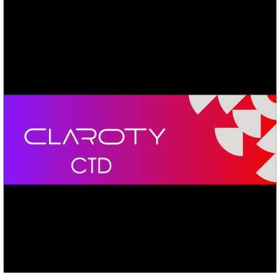
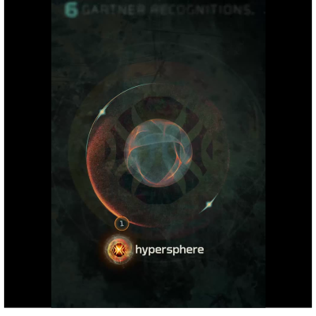

import { CardGrid, Card } from '@astrojs/starlight/components';

<CardGrid>

  <Card title="Canonical Ubuntu 26.04" icon="">
    
    Verizon.
  </Card>
  <Card title="Claroty Continuous Threat Detection (CTD) 5.x" icon="">
    
    Verizon.
  </Card>
  <Card title="HyperSphere Technolgies Vault 1.x" icon="">
    
    Verizon.
  </Card>
  <Card title="SUSE Industrial Edge" icon="">
    
    Verizon.
  </Card>
  <Card title="Verizon Intelligent API" icon="">
    
    Verizon.
  </Card>
</CardGrid>
